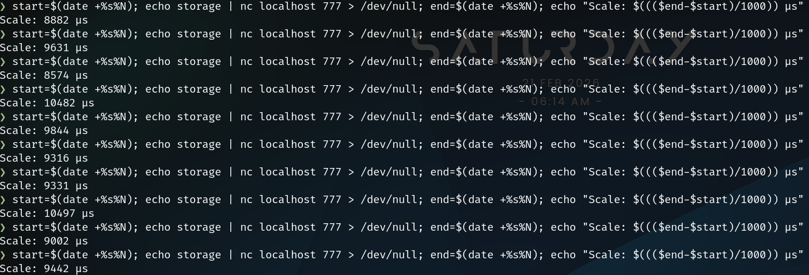
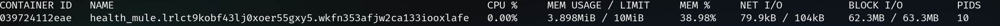
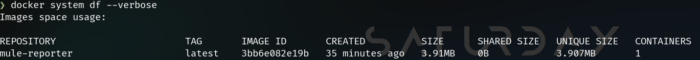

# Mule-Reporter

It's a damn fast and light (less than 10Mb RAM, less than 4Mb of storage) agent.
Pretty simple too.

## DISCLAIMER

The Mule (or Mule-Reporter, if you will) is bold.

I began to wrote this project as my first Go project a night at 4am with no sleep, to deal with the abysmal miss of simple tools to communicate between several machines on a Swarm Cluster.

So as always, I began writing my own, and I figured Go would be a fun (first) run for a project like this. I'm thinking of expanding it.

Yes, it's simple. Yes, it's dumb too. And finally yes, it's vulgar.

If you're a company that want to seem dead serious in front of your customers, don't use this. Or at least, don't expose it to them. Please.

## Intro

It runs on every node. You ask it `size` on port 777 (default but configurable) with TCP, and it answers something like `{"size": 13546712}` in a json object.

Why ? Because I can !

*Screenshot from a previous version of the Mule, please refer to the textual documentation*


I'll add more system health checks to Mule Reporter later.

### Prepare the Mule
First, make sure your docker/conf.ini file is on-point:

It should contain a section named `PORT_CONFIG`, and a key-value pair named to `talkport` mapped to the port you wanna communicate with Mule on.

```ini
[PORTS]
talkport=777
[ENV]
root="/host"
```

`talkport` is the port you're communicating with the Mule on.

`root` is the path to the root directory of your machine, from the mule. By default, it's set to `"/host"` because that's what the docker stack deployment file provides as a mountpoint for the root directory.

It's really important you set the `root` value to the root directory of your machine, or a chroot and not any fake root directory, because it's from that directory the Mule will know where to find other important Linux system files.

*Screenshot from a previous version of the Mule, please refer to the textual documentation*


**Make susre your firewall is configured accordingly, as the Mule will answer anybody querying it**.

Then, deploy your stack locally using the stack name you want.

The Mule deployment script will deploy a stack containing the mule (that will be built just-in-time) that you could call with the port you defined.

It's all in your Swarm, like other Docker services:

```bash
./deploy-stack.sh health # deploys a stack named 'health'
```
*Screenshot from a previous version of the Mule, please refer to the textual documentation*


### Examples

**Important**: While retrieving your disks, their partitions and their mountpoints, the Mule prevents duplicates, and only display the top mounting point of each partition. That way, you don't get confused when three different partitions of the same disk (apparently) have the same size and are mounted on different part of the root disk.

**Also important**: The Mule can deal with encrypted disks with LUKS. It can also deal with old HD mounts, virtual disks, logical partitions, and standard disks as well as not encrypted NVMEs. As long as they're mounted of course.

**Nota Bene** (I could find names for this all day): The Mule has been designed to work on Linux systems. If you're using Windows, know that a lot of features won't work as intended (if not **every** feature will work in unintended ways).

**Disk types**: You should be aware that there are different types of disks.
Currently mapped disk types, returned when asked to by the Mule, are as follows:
- 0. SSD
- 1. HDD
- 7. ERR (error while reading disk descriptor)

They've been mapped like this originally based on their ability to "turn" physically. When casted to a boolean, a SSD can't turn, a HDD can, and the max value of an `uint8` (the type this value is stored on) is 7.

Send `what` or `what?` to the Mule, and it will answer all the informations it got at once, that will look like:
```json
❯ echo what | nc localhost 777 | jq
{
	"timestamp": 1771648785,
	"node": {
		"RootDir": "/host",
		"hostname": "4ac6ecd414d5",
		"version": "0.0.2",
		"codename": "Drunk",
		"port": "777",
		"disks": [
			{
				"name": "dm-1",
				"type": 0,
				"partitions": [
					{
						"path": "/",
						"size": 966510419968,
						"free": 91527176192
					}
				]
			},
			{
				"name": "dm-3",
				"type": 0,
				"partitions": [
					{
						"path": "/media/XXXXX/AdditionalSSD",
						"size": 983334674432,
						"free": 223960137728
					}
				]
			},
			{
				"name": "nvme0n1",
				"type": 0,
				"partitions": [
					{
						"path": "/boot",
						"size": 989052928,
						"free": 135188480
					}
				]
			}
		]
	}
}
```

If you just wanna get the free size available on the cluster node (or machine if you're outside a cluster), send `storage`:
```json
[
	{
		"name": "dm-1",
		"type": 0,
		"partitions": [
			{
				"path": "/",
				"size": 966510419968,
				"free": 91527180288
			}
		]
	},
	{
		"name": "dm-3",
		"type": 0,
		"partitions": [
			{
				"path": "/media/XXXXX/AdditionalSSD",
				"size": 983334674432,
				"free": 223960137728
			}
		]
	}
]
```

If you want to have informations about all the connected partitions and disks on the host system, though, you can ask the Mule `disks` or `disk` and it will tell you:
```json
	[
		{
			"name": "dm-1",
			"type": 0,
			"partitions": [
				{
					"path": "/",
					"size": 966510419968,
					"free": 91527180288
				}
			]
		},
		{
			"name": "dm-3",
			"type": 0,
			"partitions": [
				{
					"path": "/media/XXXXX/AdditionalSSD",
					"size": 983334674432,
					"free": 223960137728
				}
			]
		},
		{
			"name": "nvme0n1",
			"type": 0,
			"partitions": [
				{
					"path": "/boot",
					"size": 989052928,
					"free": 135188480
				}
			]
		}
	]
```

### Who is the Mule ?
I simply played too much of Deep Rock Galactic lately.

The Mule is a loyal agent who's always there, and does what it's told to.

## How to run the Mule
The provided script, build-image.sh, builds a Docker image from the given dockerfile.

What the Dockerfile does is:
- Building the Go project from golang/alpine builder image
- Transfer built binaries into a scratch image
- Run the mule on a thin and fast Docker image, tailored just for that use

What the Dockerfile does **NOT** do (and that the docker stack file does):
- Read-Only access to host filesystem (needed to read the available space)
- Binds to the Docker socket to pilot it (upcoming features)


*Screenshot from a previous version of the Mule, please refer to the textual documentation*

## this project depends on some third-party libraries:
- gopkg.in/ini.v1
	- To read the same ini file used to interact with the backend

## Performances
I like to show off a program when it runs well. Here are the stats of the Mule-Reporter:
### Client-side response time on localhost, when hosted on a swarm cluster
*(It's in micro-seconds, or µs. If you want that in milliseconds or ms, divide by 1000)*

### RAM usage
Idle Mule's RAM usage (can go up to 9.8Mb)

### Mule's size in storage
The Mule doesn't take that much space for itself, and still, it does its work just fine:

## todo:
- configure auto /etc/docker/daemon.json config ("insecure-registries" : ["192.168.1.XX:5000"])