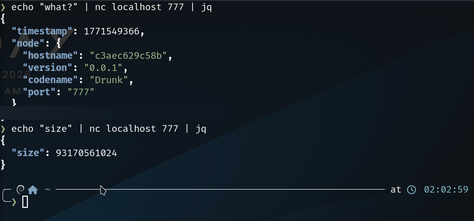
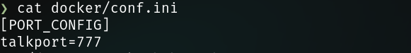
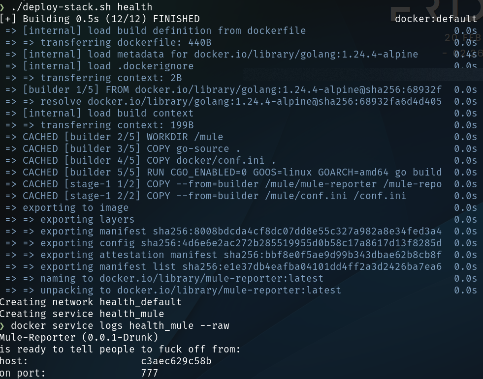
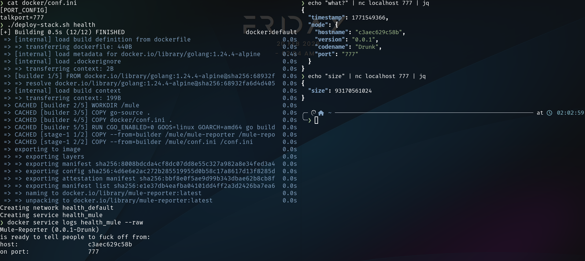

# Mule-Reporter

It's a damn fast and light agent.
Pretty simple too.

## DISCLAIMER

The Mule (or Mule-Reporter, if you will) is bold.

I began to wrote this project as my first Go project a night at 4am with no sleep, to deal with the abysmal miss of simple tools to communicate between several machines on a Swarm Cluster.

So as always, I began writing my own, and I figured Go would be a fun (first) run for a project like this. I'm thinking of expanding it.

Yes, it's simple. Yes, it's dumb too. And finally yes, it's vulgar.

If you're a company that want to seem dead serious in front of your customers, don't use this. Or at least, don't expose it to them. Please.

## Intro

It runs on every node. You ask it `size` on port 777 (default but configurable) with TCP, and it answers something like `{"size": 13546712}` in a json object.

Why ? Because I can !



I'll add more system health checks to Mule Reporter later.

### Prepare the Mule
First, make sure your docker/conf.ini file is on-point:

It should contain a section named `PORT_CONFIG`, and a key-value pair named to `talkport` mapped to the port you wanna communicate with Mule on.

```ini
[PORT_CONFIG]
talkport=777
```



**Make susre your firewall is configured accordingly, as the Mule will answer anybody querying it**.

Then, deploy your stack locally using the stack name you want.

The Mule deployment script will deploy a stack containing the mule (that will be built just-in-time) that you could call with the port you defined.

It's all in your Swarm, like other Docker services:

```bash
./deploy-stack.sh health # deploys a stack named 'health'
```


### Examples
Send `what` or `what?` to the Mule, and it will answer something like:
```json
{
  "timestamp": 1771549366, // <- Unix timestamp to get the current time on the remote machine
  "node": {
    "hostname": "c3aec629c58b", // <- container or machine name if it's running on host
    "version": "0.0.1", // <- Mule version that's answering and running on this machine
    "codename": "Drunk", // <- Version codename (changes at major versions)
    "port": "777" // <- Port used to communicate (that you should know already, if you got that info)
  }
}
```

If you just wanna get the free size available on the cluster node (or machine if you're outside a cluster), send `size`:
```json
{
  "size": 93170561024 // <- Number of free bytes on the host disk (not the container !!!)
}
```

### Who is the Mule ?
I simply played too much of Deep Rock Galactic lately.

The Mule is a loyal agent who's always there, and does what it's told to.

## How to run the Mule
The provided script, build-image.sh, builds a Docker image from the given dockerfile.

What the Dockerfile does is:
- Building the Go project from golang/alpine builder image
- Transfer built binaries into a scratch image
- Run the mule on a thin and fast Docker image, tailored just for that use

What the Dockerfile does **NOT** do (and that the docker stack file does):
- Read-Only access to host filesystem (needed to read the available space)
- Binds to the Docker socket to pilot it (upcoming features)



## this project depends on some third-party libraries:
- gopkg.in/ini.v1
	- To read the same ini file used to interact with the backend
## todo:
- configure auto /etc/docker/daemon.json config ("insecure-registries" : ["192.168.1.XX:5000"])