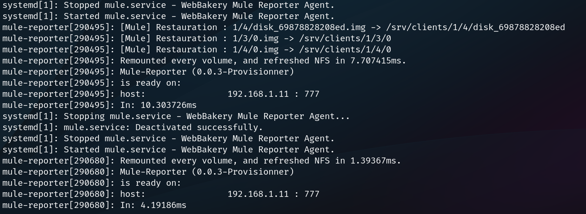
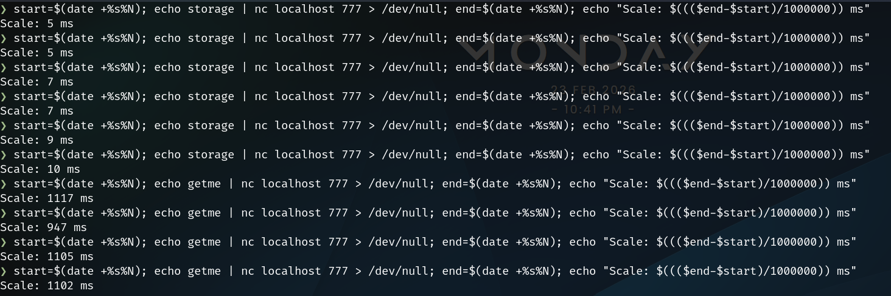
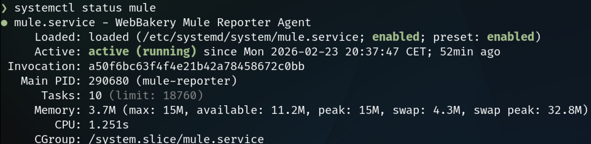
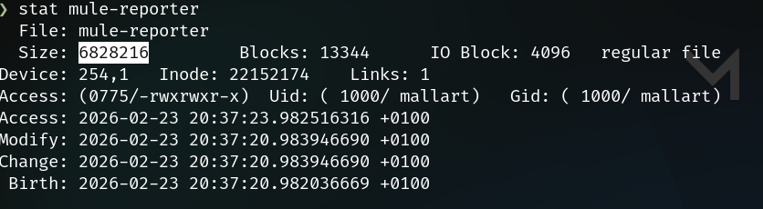
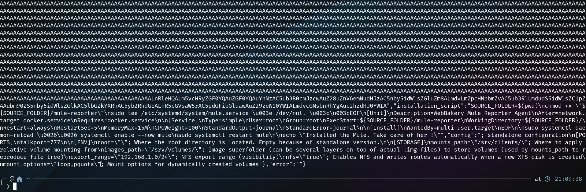

# Mule-Reporter

It's a damn fast and light (less than 20Mb RAM, less than 7Mb of storage) agent.
Pretty simple too.

The Mule is a lightweight, high-performance storage orchestration agent written in Go. It handles dynamic XFS volume provisioning, project-based quotas, and automated NFS exports for distributed environments like Docker Swarm.

# TL;DR: Why the Mule?

- **Performance**: <20ms orchestration (Go-powered).

- **Security**: XFS Hard-Quotas & CIDR filtering.

- **Zero Config**: Self-replicating agent (getme command).

- **Lightweight**: 20MB RAM, 7MB Binary. No junk, just metal.

## DISCLAIMER

The Mule (or Mule-Reporter, if you will) is bold.

I began writing this project as my first Go project a night at 4am with no sleep, to deal with the abysmal miss of simple tools to communicate between several machines on a Swarm Cluster.

So as always, I began writing my own, and I figured Go would be a fun (first) run for a project like this. I'm thinking of expanding it.

Yes, it's simple. Yes, it's dumb too. And finally yes, it's vulgar.

If you're a company that wants to seem dead serious in front of your customers, don't use this. Or at least, don't expose it to them. Please.

## Intro

It runs on every machine you install it on. You ask it `size` on port 777 (default but configurable) with TCP, and it answers something like `{"size": 13546712}` in a json object.

Why ? Because I can !

I'll add more system health checks to Mule Reporter later.

### Prepare the Mule
First, make sure your `conf.ini` file is on-point:

It should contain several sections, and mandatory keys;
- **PORTS**
	- talkport (port used by the mule to communicate with the outside world)
- **ENV**
	- root (root directory for this filesystem, will be used by the mule to navigate for some features)
	- accept_cidr_range (accepted range of IPs from a CIDR mask, other IPs will get rejected while being served a closed socket)
- **STORAGE** (Now it's getting serious)
	- `nfs` (can be `true` or whatever else; Enables NFS and writes routes automatically when a new XFS disk is created.)
	- `mount_options` (Mount options for dynamically created volumes)
	- `export_range` (CIDR value to set the NFS export range / visibility)
	- `mounts_path`(e.g. "/srv/mount/"; Where to apply relative volume mounting from)
	- `images_path`(e.g. "/srv/images/"; Image superfolder can be several layers on top of actual .img files to store volumes (used by mounts_path to reproduce file tree))

**Example of a valid configuration file:**

```ini
; standalone configuration
[PORTS]
talkport=777

[ENV]
root=""
accept_cidr_range="192.168.0.0/32"; Accepted IP range, based on a CIDR mask. Other IPs contacting the Mule will have no response and a closed socket.

[STORAGE]
mounts_path="/srv/mount/"
images_path="/srv/images/"
export_range="192.168.1.0/24"
nfs="true"
mount_options="loop,pquota"
```
It's really important you set the `root` value to the root directory of your machine, or a chroot and not any fake root directory, because it's from that directory the Mule will know where to find other important Linux system files.


**Make sure your firewall is configured accordingly, as the Mule will answer anybody querying it**.

(Think of renaming `conf.example.ini` to `conf.ini` if you want to use the provided one)

You're now ready to unleash the Mule !

You can use provided scripts if you don't want to compile and register the Mule to systemd yourself (I currently didn't write scripts for other service managers) like this:

```bash
./compile.sh # Compile the Mule and reloads systemd daemons
./service-subscribe.sh # Adds the mule to the systemd services and reload the systemd daemon
```

### Examples

**Important**: While retrieving your disks, their partitions and their mountpoints, the Mule prevents duplicates, and only display the top mounting point of each partition. That way, you don't get confused when three different partitions of the same disk (apparently) have the same size and are mounted on different part of the root disk.

**Also important**: The Mule can deal with encrypted disks with LUKS. It can also deal with old HD mounts, virtual disks, logical partitions, and standard disks as well as not encrypted NVMEs. As long as they're mounted of course.

**Nota Bene** (I could find names for this all day): The Mule has been designed to work on Linux systems. If you're using Windows, know that a lot of features won't work as intended (if not **every** feature will work in unintended ways).

**Disk types**: You should be aware that there are different types of disks.
Currently mapped disk types, returned when asked to by the Mule, are as follows:
- 0. SSD
- 1. HDD
- 7. ERR (error while reading disk descriptor)

They've been mapped like this originally based on their ability to "turn" physically. When casted to a boolean, a SSD can't turn, a HDD can, and the max value of an `uint8` (the type this value is stored on) is 7.

Send `what` or `what?` to the Mule, and it will answer all the information it got at once, that will look like:
```json
❯ echo what | nc localhost 777 | jq
{
	"timestamp": 1771648785,
	"node": {
		"RootDir": "/",
		"hostname": "192.168.1.50",
		"version": "0.0.3",
		"codename": "Provisionner",
		"port": "777",
		"disks": [
			{
				"name": "dm-1",
				"type": 0,
				"partitions": [
					{
						"path": "/",
						"size": 966510419968,
						"free": 91527176192
					}
				]
			},
			{
				"name": "dm-3",
				"type": 0,
				"partitions": [
					{
						"path": "/media/XXXXX/AdditionalSSD",
						"size": 983334674432,
						"free": 223960137728
					}
				]
			},
			{
				"name": "nvme0n1",
				"type": 0,
				"partitions": [
					{
						"path": "/boot",
						"size": 989052928,
						"free": 135188480
					}
				]
			}
		]
	}
}
```

If you just wanna get the free size available on the cluster node (or machine if you're outside a cluster), send `storage`:
```json
[
	{
		"name": "dm-1",
		"type": 0,
		"partitions": [
			{
				"path": "/",
				"size": 966510419968,
				"free": 91527180288
			}
		]
	},
	{
		"name": "dm-3",
		"type": 0,
		"partitions": [
			{
				"path": "/media/XXXXX/AdditionalSSD",
				"size": 983334674432,
				"free": 223960137728
			}
		]
	}
]
```

If you want to have information about all the connected partitions and disks on the host system, though, you can ask the Mule `disks` or `disk` and it will tell you:
```json
	[
		{
			"name": "dm-1",
			"type": 0,
			"partitions": [
				{
					"path": "/",
					"size": 966510419968,
					"free": 91527180288
				}
			]
		},
		{
			"name": "dm-3",
			"type": 0,
			"partitions": [
				{
					"path": "/media/XXXXX/AdditionalSSD",
					"size": 983334674432,
					"free": 223960137728
				}
			]
		},
		{
			"name": "nvme0n1",
			"type": 0,
			"partitions": [
				{
					"path": "/boot",
					"size": 989052928,
					"free": 135188480
				}
			]
		}
	]
```

#### More complex queries

Since 0.0.3 Provisionner, the Mule supports JSON bodies for some queries;

- Disk creation
- Disk removal

Go will try to marsahl your JSON body into corresponding structs, and if it fails with every available type in this given context, it will throw an error.

For answers, write on the Mule's TCP socket:

```json
{
	"user": "1", // user of XFS project
	"server": "serverId", // called server for legacy reasons, is really the XFS project
	"size": "sizeHuman", // Human-readable size format (e.g. 1G, 512M)
	"name": "customName", // Volume custom name
	"mount_path": "mount_path", // Where to mount the created volume on the target machine
	"image_path": "image_path" // Where to **store** the created volume image on the target machine
}
```
*Please note that using a non-coherent `mount_path` and `image_path` regarding the Mule's conf.ini will result in a failure to auto-mount these volumes at startup / reboot.*

### Who is the Mule ?
I simply played too much of Deep Rock Galactic lately.

The Mule is a loyal agent who's always there, and does what it's told to.

## How to run the Mule
The provided script, compile.sh, builds the program in a standalone version, compatible with any other machine using the same kernel as you do (not necessarily the same distribution, as Go will package the executable with necessary library binaries) and restarts `systemd`.

Once started, it automatically scans recursively and concurrently (*multithread execution*) the given (in conf.ini) `images_path` directory and mount every `.img` file found from the `mounts_path` directory, reconstructing the whole needed file tree in the process.

For every disk mounted, the Mule also adds an NFS entry for it in `/etc/exports.d/{disk_name}`, if enabled in the configuration file.

`service_subscribe.sh` should be run only once, though it's mandatory for the mule to start automatically at startup (it creates a new systemd service). If you want to edit how the Mule behaves as a systemd service, go edit this file.

## this project depends on some third-party libraries:
- gopkg.in/ini.v1
	- To read the same ini file used to interact with the backend

## Performances
I like to show off a program when it runs well. Here are the stats of the Mule-Reporter:
### Client-side response time on localhost, when hosted on a swarm cluster
*(It's in milliseconds, the same unit used to measure ping or packet latency)*


The Mule is built for speed: it dispatches parallel mount operations and NFS refreshes so fast that even with dozens of volumes, it usually finishes the job in under 20ms—literally before you can blink

Now, we're trying to get the available storage several times in a row (~7ms on average), then we're asking the Mule to replicate herself and get her code (~1s for her to get the code and send it back with other script and conf.ini file):

### RAM usage
Idle Mule's RAM usage (can go up to 15Mb, still works with 15Mb or less)

### Mule's size in storage
The Mule doesn't take that much space for itself (~6Mb), and still, it does its work just fine:


## Why did I drop Docker Swarm support ?
This project was intended to work in harmony with Docker Swarm and be deployed in a cluster.

There was a huge problem with that though. Swarm naturally blocks any *"filesystem evasion attempt"*, which the Mule depends on to create disks with mkfs.xfs, and auto-mounting. I was in a dilemma where I had to choose to drop some features (or try harder to exploit Swarm vulnerabilities to create a **legit** tool) or to take another approach and start (almost) from scratch again with a new paradigm.

I choose to start all over again, but with more security, reliability, and most importantly without dropping the ease of doing "`docker stack -c docker-stack.yml mystack`".

So I made the Mule a self-replicating agent from any source. You can now call any machine that hosts the mule with the string "`getme`", and here's what happen after a  `echo "getme" | nc localhost 777`:



The mule answers with a whole JSON containing 3 fields, respectively:

```json
{
	"message":
	{
		"installation_script":"...", // a runnable bash script to install the mule from this JSON's contents
		"config":"...", // the contents of this Mule's conf.ini path (not the one loaded in memory, but the one from disk that she loaded at startup)
		"base64_binary":"..." // the Mule's own binary, encoded in base64 to prevent data loss
	}
}
```

Now you've got three things, which you can do whatever you want with:
- An installation script for the mule, which you can run to subscribe the Mule to systemd services and make the Mule one of them
- The original Mule's conf.ini file, to replicate the exact same behavior everywhere
- A base64 encoded string containing the app's binary, compatible with any identical kernel (because embedding needed libraries)

Simply decode the base64 and save it to an executable, save the conf.ini file, run the bash script, and you're all set !

And if that's still too many steps for you, I wrote it for you too. Check out [The Getme script](./from-machine.sh).

Or simply run this, it does the same as I just described (though I'll never advise you to run some script you found online without reading it first):
```bash
./from-machine.sh <remote_ip> <port>
```
